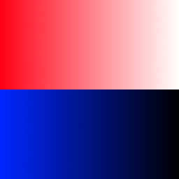

# AGCRemapper
---
A simple tool that allow you to create GoldSrc textures that can have their colors remapped, for example, multiplayer player models.
Made in Python using PySimpleGui and Pillow.

**Heavily work in progress!**
## Usage
1. Have a BMP file that you want to convert. Example:

 

2. Create 1 or 2 masks that have the same size as the original image. Non black (#000000) areas will be seen as the parts you want to recolor. Examples:

  (Mask 1)
  (Mask 2)

3. Start AGCRemapper and open your files
4. Convert! The result file will be ```Remap!_128_191_255.bmp``` or ```thumbnail.bmp```
5. Rename your file to...
    * (model texture) ```Remap!_128_191_255``` where ```!``` should be replaced with a single number or capital letter of the English alphabet (0-9, A-Z). Make sure that your SMD and QC files uses the same texture names!
    * (thumbnail) make sure that the filename matches your MDL's name!
    * Preview thumbnails are WIP!
6. Compile the model with the tool of your choice (e.g.: Crowbar) / copy the thumbnail to MDL's folder.
7. Enjoy!

 

 ***Tip:*** Make sure that your masks don't overlap for best resulst!

## Known Issues

* Thumbnail masks don't work if they are non-square black and white BMPs. Use other image formats, or just use another color instead of white.

---
Thanks to [The303](https://the303.org/) for his tutorials!